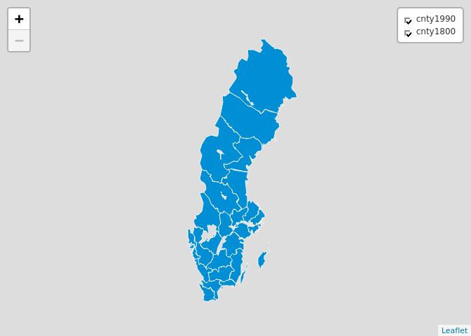

<!-- README.md is generated from README.Rmd. Please edit that file -->

# Leaflet-wrapper

Provides wrapper functions for leaflet maps in R, using the excelent
[leaflet R package](https://github.com/rstudio/leaflet). Defaults set to
plotting Swedish maps in projection epsg:3006

## Installation:

``` r
    devtools::install_github("junkka/leafletwrapper")
```

## Usage

``` r
library(histmaps)
library(leafletwrapper)
library(leaflet)
library(tidyverse)
```

    ## ── Attaching packages ─────────────────────────────────────── tidyverse 1.3.1 ──

    ## ✓ ggplot2 3.3.5     ✓ purrr   0.3.4
    ## ✓ tibble  3.1.3     ✓ dplyr   1.0.7
    ## ✓ tidyr   1.1.3     ✓ stringr 1.4.0
    ## ✓ readr   2.0.1     ✓ forcats 0.5.1

    ## ── Conflicts ────────────────────────────────────────── tidyverse_conflicts() ──
    ## x dplyr::filter() masks stats::filter()
    ## x dplyr::lag()    masks stats::lag()

``` r
cnty1800 <- get_boundaries(1800, "county")
cnty1990 <- get_boundaries(1990, "county")

leaf_init() %>%
  leaf_polygon(cnty1800, interactive = T,lbl = "name") %>% 
  leaf_polygon(cnty1990, interactive = T,lbl = "name") %>% 
  leaf_controls() 
```


